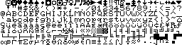

# img2pcd8544

This utility converts images to to a format suitable for the PCD8544 LCD
controller. It currently supports 3 modes:

 - Font mode. ex: `img2pcd8544 --font /path/to/font.png C_CONST_NAME 6 8`
 - Bitmap mode. ex: `img2pcd8544 --bmp /path/to/input.png C_CONST_NAME`
 - Preview mode. ex: `img2pcd8544 --fmt /path/to/input.png /path/to/output.png`

**Note**: This utility was made in support of the
[libsangster_avr](https://github.com/sangster/libsangster_avr) convenience
library, but it should be simple enough to adapt for other uses.


## Font mode

This mode converts an image file to a C header file which can be used as a font
with `sangster/pcd8544/text.h` from `libsangster_avr`.

**Usage:** `img2pcd8544 --font INPUT_IMG FONT_NAME CHAR_W CHAR_H`

| Argument | Description |
| --- | --- |
| `INPUT_IMG` | The image file to convert to a font. The width must be a multiple of `CHAR_W` and the height must be a multiple of `CHAR_H`. The filetype can be any supported by ImageMagick. The image itself must contain a grid of CHAR_W x CHAR_H glyphs. |
| `FONT_NAME` | The C identifier that will be used to name this font in the genrated header file. |
| `CHAR_W`    | The width of every character in the font, in pixels. |
| `CHAR_H`    | The height of every character in the font, in pixels. Currently, this must be exactly `8`. |

[docs/example-font.png](docs/example-font.png) contains an exaple input file,
containing a square (8x8 px) font.  To convert this to a font header, use this
command:

```sh
img2pcd8544 --font docs/example-font.png EXAMPLE 8 8 > example_font.h
```

### Example input image


### Example output header file
The [Arduino Pong](https://github.com/sangster/arduino-pong) project has an
example output file:
[logo.h](https://github.com/sangster/arduino-pong/blob/master/font.h). This
file was created using the same input file as
[example-font.png](docs/example-font.png), but to save space on the Arduino
every non-digit character was removed.


## Bitmap mode

This mode converts an image file to a C header file which can be used as a
bitmap image with `sangster/pcd8544/bmp.h` from `libsangster_avr`.


**Usage:** `img2pcd8544 --bmp INPUT_IMG CONST_NAME`

| Argument | Description |
| --- | --- |
| `INPUT_IMG` | The image file to convert to a bipmap header. The filetype can be any supported by ImageMagick. |
| `CONST_NAME` | The C identifier that will be used to name this image in the genrated header file. |

Although the image can be essentially anything supported by ImageMagick, it
will be shrunk down to fit within a 48x84 px frame, and converted to 1-bit
"color," so you may need to massage your input file to get decent results.

### Example output header file

The [Arduino Pong](https://github.com/sangster/arduino-pong) project has an
example output file:
[logo.h](https://github.com/sangster/arduino-pong/blob/master/logo.h).


## Preview mode

This mode is really just a tool to help you create decent input images for
`img2pcd8544 --bmp`. It outputs a new image file showing approximately what the
bitmap will look like on the LCD screen.


**Usage:** `img2pcd8544 --fmt INPUT_IMG OUTPUT_IMG`

| Argument | Description |
| --- | --- |
| `INPUT_IMG` | The image file to convert to a bipmap. The filetype can be any supported by ImageMagick. |
| `OUTPUT_IMG` | The path to write the new image to. |


## Installation

```sh
git clone git@github.com:sangster/img2pcd8544.git
cd img2pcd8544
make && sudo make install
```

## Depndencies

 - `libmagick`: The [ImageMagick](http://imagemagick.org/) C library.


## License

This project is licensed under the GPL License - see the [LICENSE](./LICENSE)
file for details
